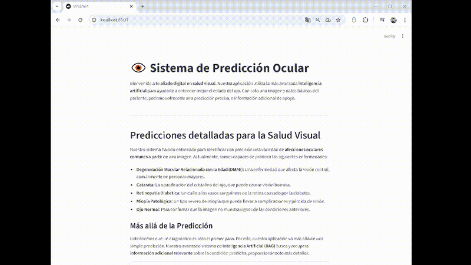

# Sistema de Predicción Ocular  
En este repositorio encontraras una aplicación que combina la **inteligencia artificial** con el análisis de imágenes para ayudarte a comprender mejor el estado de tus ojos.  

Con solo una **imagen** y algunos **datos básicos del paciente**, el sistema es capaz de ofrecer:  
- Una predicción precisa sobre la condición ocular.  
- Información adicional de apoyo para comprender mejor cada diagnóstico.  

---

## Predicciones detalladas para la salud visual  

El modelo ha sido entrenado para identificar con gran precisión una variedad de **afecciones oculares comunes**. Actualmente, puede predecir:  

- **Degeneración Macular Relacionada con la Edad (DMAE):** Afecta la visión central, común en personas mayores.  
- **Catarata:** Opacificación del cristalino que causa visión borrosa.  
- **Retinopatía Diabética:** Daño a los vasos sanguíneos de la retina ocasionado por la diabetes.  
- **Miopía Patológica:** Forma severa de miopía que puede generar complicaciones graves.  
- **Ojo Normal:** Confirmación de que no se detectan alteraciones.  

---

## Más allá de la predicción  
 Nuestro sistema utiliza **RAG (Retrieval-Augmented Generation)** para buscar y recuperar información confiable sobre la condición predicha y ofrece al usuario detalles adicionales que enriquecen la comprensión del resultado.  

Con este enfoque, no solo **identificamos la afección**, sino que también **aportamos conocimiento y contexto** para una mejor toma de decisiones.  


# Estructura del repositorio
```
├── 224x224                       #Galeria Imágenes preprocesadas y formatos 224
├── 384x384                       #Galeria Imágenes preprocesadas y formatos 384
├── app                           #Aplicación final (API/Interfaz/RAG) 
├── archive                       #Histórico de Scripts
├── arquitectura_entrenamientos   #Creación de dataset final, Experimentos de aquitecturas y/o modelos y optimización de modelo neuronal final.
├── Data                          #Fuentes de información(Csv,Dataset,Parqutes...)
├── demo                          #Video demostración
├── EDA                           #Análisis exploratorio del dataset(metadatos) e imagenes 
├── info_inicial                  #Fuentes de información (Recolección de Datasets para el proyecto)
├── meeting                       #Resumenes de las reuniones de equipo
├── memoria                       #Memoria del proyecto
├── MLFLow                        #Inicialización MlFlow
├── mlruns                        #Datos experimentos en MlFlow
├── ODIR-5K                       #Imágenes dataset originales
├── preprocesado                  #Preparacion/transformación de los datos
├── presentacion                  #Presentación del proyecto
├── requirements.txt              #Librerias necesarias para el proyecto
└── README.md                     #Este archivo
```
# Instalación de dependencias

Antes de ejecutar la aplicación, asegúrate de tener **Python 3.8+** instalado.  
Luego, instala todas las librerías necesarias ejecutando:

```bash
pip install -r requirements.txt
```

# Configuración del RAG (Requerido)

Para poder ejecutar correctamente el módulo de **RAG (Retrieval-Augmented Generation)**, necesitas configurar tu clave de OpenAI:

1. En la carpeta raíz del proyecto, crea un fichero llamado **`.openai_key`**  
2. Dentro de este fichero pega tu **API Key de OpenAI**, por ejemplo:

   ```
   sk-XXXXXXXXXXXXXXXXXXXXXXXXXXXX
   ```

3. Guarda el archivo. El sistema leerá automáticamente esta clave al ejecutar los scripts del RAG.

> **Importante:**  
> - No compartas tu API Key en repositorios públicos.  
> - Añade `.openai_key` a tu `.gitignore` para evitar subirlo por accidente a GitHub

# Puesta en marcha de la aplicación

Existen dos formas de iniciar la aplicación en tu entorno local:

---

##  Opción 1: Manual (FastAPI + Streamlit)

Desde la carpeta raíz, ejecuta los siguientes comandos:

### 1) Activar la API (FastAPI)
```bash
fastapi dev app/main.py --reload
```
FastAPi: [http://127.0.0.1:8000](http://127.0.0.1:8000)

### 2) Activar la interfaz (Streamlit)
```bash
streamlit run app/app.py
```
Aplicación disponible en: [http://localhost:8501](http://localhost:8501)

>  Una vez ambos servicios estén activos, podrás interactuar con la aplicación desde el navegador.

---

##  Opción 2: Usando Docker

Para levantar toda la aplicación directamente con nuestra configuración desde la carpeta /app ejecutamos:

```bash
docker compose up
```

Esto iniciará automáticamente tanto la API como la interfaz en sus respectivos puertos.


# Funciones adicionales

Estas utilidades son opcionales y sirven para ampliar o personalizar el proyecto:

- **Transformar imágenes a 224×224**  
  ```bash
  python preprocesado/imagenes/transform_img.py 224
  ```

- **Crear el dataset (imágenes + metadatos)**  
  ```bash
  python arquitectura_entrenamientos/create_split_dataset.py
  ```

- **Entrenar el modelo**  
  ```bash
  python arquitectura_entrenamientos/red_neuronal_final.py
  ```

- **Transformar/Limpiar PDF a TXT (RAG)**  
  ```bash
  python app/RAG/transform.py app/RAG/documentos/consenso_DMAE.pdf
  ```
  El TXT resultante se guarda en: `app/RAG/Fixed`

- **Vectorizar (generar índices para RAG)**  
  ```bash
  python app/RAG/chunks.py
  ```
  Se generan dos archivos: uno **JSON** y otro **FAISS** (usado por el RAG).

---

# Herramientas de seguimiento

- **MlFlow** → Para visualizar los registros de los entrenamientos:  
  ```bash
  mlflow ui
  ```
- **Log** → Para visualizar los registros de las predicciones realizadas en la aplicación, puedes consultarlos en  -app\prediction_log.csv 

Si quieres visualizar los ejemplos(imagenes + documentos de información adicional) estan en las carpetas -app\temp_docs    -app\temp_images

# Ejemplo de uso


[Ver demo en alta calidad (MP4)](demo/demofinal.mp4)

# Autores

| Nombre            | Contacto | LinkedIn | GitHub |
|-------------------|----------|----------|--------|
| **David Sotelo**         | 📧 [davidsoteloseguin@gmail.com](mailto:davidsoteloseguin@gmail.com) | [🔗 Perfil](https://www.linkedin.com/in/david-sotelo-seguin/) | [💻 DaSotSe](https://github.com/DaSotSe) |
| **Javier Luque**        | 📧 [javiluque78@gmail.com](mailto:javiluque78@gmail.com) | [🔗 Perfil](https://www.linkedin.com/in/javier-luque-escobosa-56a911166/) | [💻 javiluq](https://github.com/javiluq) |
| **Leticia Cabañas**       | 📧 [leticia.c.morales@gmail.com](mailto:leticia.c.morales@gmail.com) | [🔗 Perfil](https://www.linkedin.com/in/leticiacaba%C3%B1asmorales/) | [💻 Leticia2512](https://github.com/Leticia2512) |
| **Miguel Ángel Pardo**  | 📧 [mapardo@gmail.com](mailto:mapardo@gmail.com) | [🔗 Perfil](https://www.linkedin.com/in/mapardocea/) | [💻 mapardo-lab](https://github.com/mapardo-lab) |
| **Nauzet Fernández** | 📧 [Nauzet.fdez@gmail.com](mailto:Nauzet.fdez@gmail.com) | [🔗 Perfil](https://www.linkedin.com/in/nauzet-fernandez-lorenzo/) | [💻 NauziX](https://github.com/NauziX) |
| **Sara Cárcamo**          | 📧 [sara.carcamo.r@gmail.com](mailto:sara.carcamo.r@gmail.com) | [🔗 Perfil](https://www.linkedin.com/in/saracarcamo/) | [💻 SCaRreC](https://github.com/SCaRreC) |
| **Sofía Gabián**         | 📧 [sofiagabian80@gmail.com](mailto:sofiagabian80@gmail.com) | [🔗 Perfil](https://www.linkedin.com/in/sof%C3%ADa-gabi%C3%A1n-dom%C3%ADnguez/) | [💻 chofas80](https://github.com/chofas80) |


>Gracias por visitar este repositorio y dedicar tu tiempo a conocer nuestro trabajo.  
Si tienes dudas, comentarios o sugerencias, no dudes en ponerte en contacto con cualquiera de los autores. Estaremos encantados de ayudarte y recibir tu feedback para seguir mejorando. 
